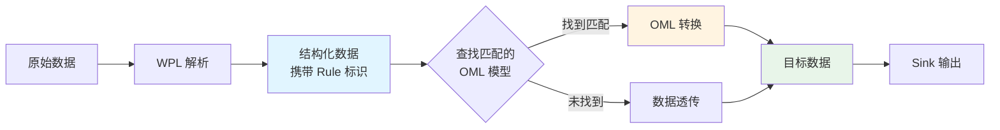
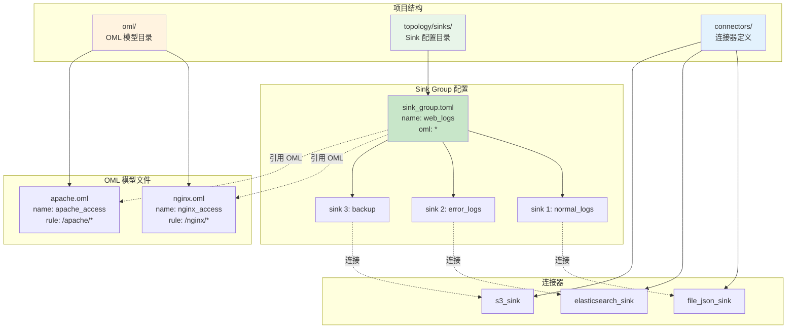
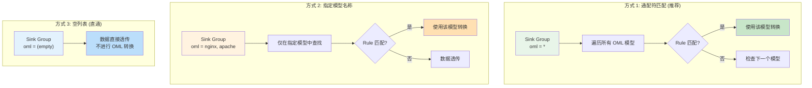
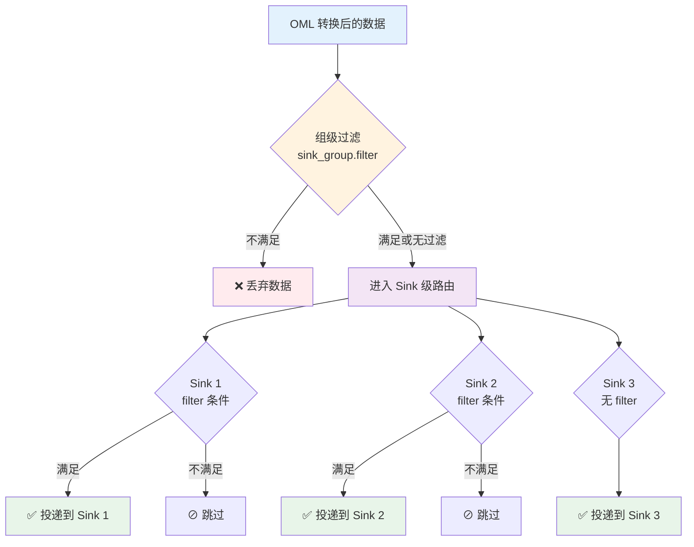
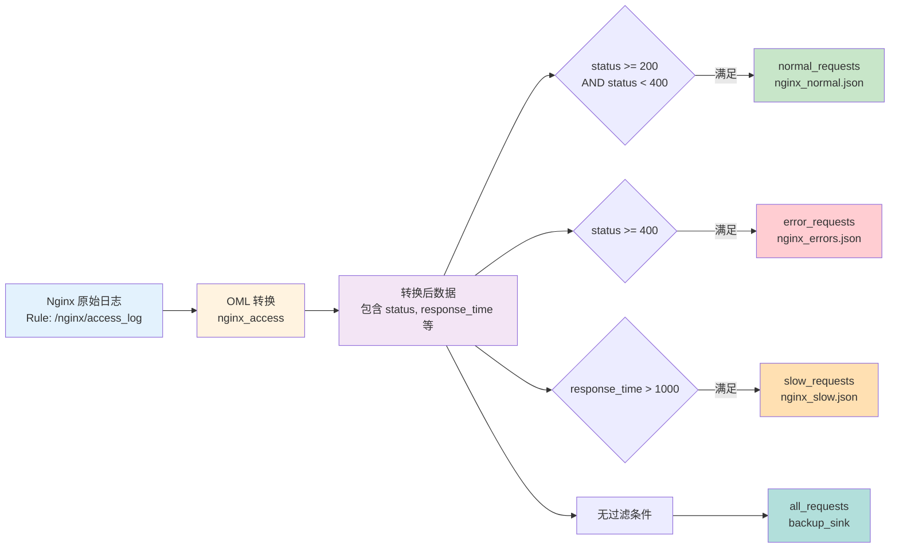
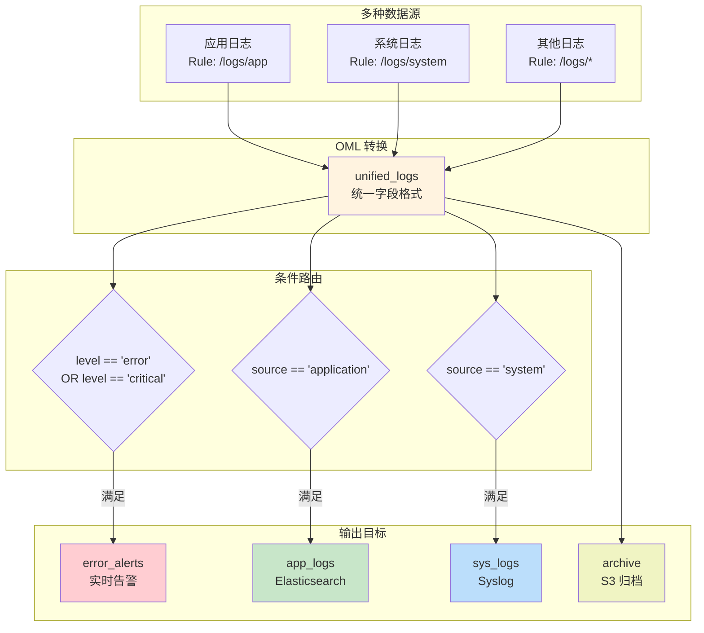
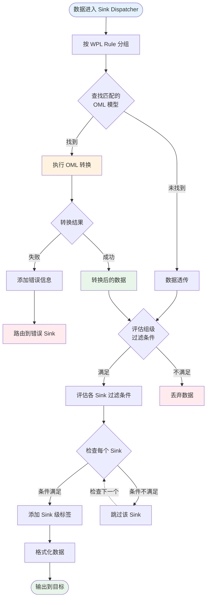
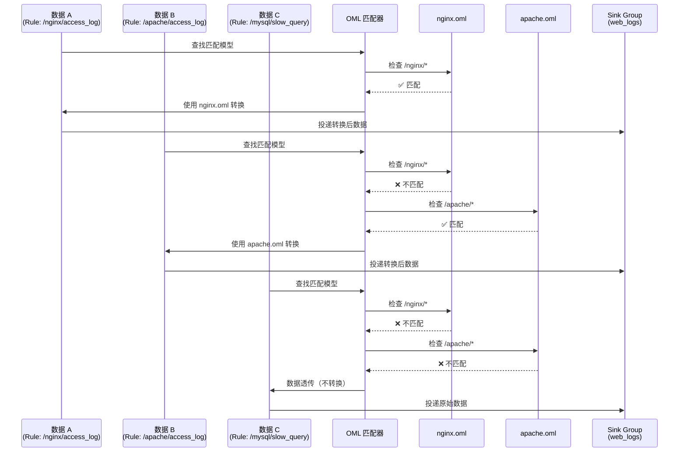
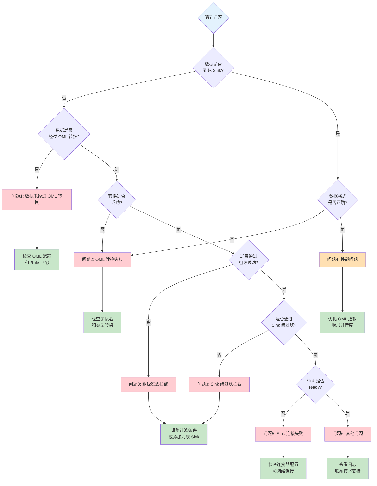

# OML的应用

本文档从使用者视角说明如何在 Sink 配置中使用 OML 进行数据转换和路由。

## 目录

1. [核心概念](#核心概念)
2. [配置结构](#配置结构)
3. [OML 与 Sink Group 关联](#oml-与-sink-group-关联)
4. [条件路由](#条件路由)
5. [完整示例](#完整示例)
6. [工作流程](#工作流程)
7. [故障排查](#故障排查)
8. [最佳实践](#最佳实践)

## 核心概念

### OML 在数据流中的作用

在 WP Engine 数据处理流水线中，OML 扮演**数据转换引擎**的角色：



### 关键概念

- **WPL Rule（规则路径）**：标识数据来源和类型（如 `/nginx/access_log`）
- **OML Model（对象模型）**：定义如何转换数据的 OML 配置文件
- **Sink Group（输出组）**：定义数据输出的目标集合
- **规则匹配（Rule Matching）**：通过通配符将 WPL Rule 与 OML Model 关联

## 配置结构

### 配置文件关系



### Sink Group 配置文件

Sink Group 配置文件通常位于 `topology/sinks/` 目录下，使用 TOML 格式：

```toml
version = "2.0"

[sink_group]
name = "业务日志组"        # 输出组名称
oml = ["*"]               # 关联的 OML 模型（通配符）
rule = []                 # 可选：限定处理的 WPL 规则
parallel = 1              # 可选：并行度（默认 1）
tags = ["env:prod"]       # 可选：组级标签
filter = "status >= 400"  # 可选：组级过滤条件

[[sink_group.sinks]]
name = "错误日志"
connect = "file_json_sink"   # 连接器 ID
filter = "level == 'error'"  # 可选：Sink 级过滤条件
filter_expect = true         # 默认 true，条件满足时投递
tags = ["type:error"]        # 可选：Sink 级标签

[sink_group.sinks.params]
file = "error.json"
```

### OML 模型文件

OML 模型文件通常位于 `oml/` 目录下，使用 `.oml` 扩展名：

```oml
name : nginx_access
rule : /nginx/*           # 匹配的 WPL 规则（通配符）
---
# 字段转换定义
user_id : chars = take(user_id);
occur_time : time = take(time);
status : digit = take(status_code) { _ : digit(0) };
uri : chars = take(request_uri);
```

## OML 与 Sink Group 关联

### 关联方式

Sink Group 通过 `oml` 字段与 OML 模型建立关联：



#### 1. 通配符匹配（推荐）

```toml
[sink_group]
name = "all_logs"
oml = ["*"]  # 匹配所有 OML 模型
```

**工作原理**：
- 数据携带 WPL Rule（如 `/nginx/access_log`）
- 遍历所有 OML 模型，查找其 `rule` 字段能匹配此 Rule 的模型
- 找到后使用该 OML 模型进行数据转换

#### 2. 指定模型名称

```toml
[sink_group]
name = "nginx_logs"
oml = ["nginx_access", "nginx_error"]  # 仅使用这些 OML 模型
```

**工作原理**：
- 只在指定的 OML 模型列表中查找匹配
- 适用于明确知道需要哪些 OML 模型的场景

#### 3. 空列表（直通）

```toml
[sink_group]
name = "raw_logs"
oml = []  # 不使用任何 OML 转换
```

**工作原理**：
- 数据不经过 OML 转换，直接透传
- 适用于不需要数据转换的场景

### 匹配规则

**OML 模型匹配逻辑**：

```rust
// 伪代码说明匹配过程
fn find_matching_oml(data_rule: &str, oml_models: &[OmlModel]) -> Option<&OmlModel> {
    for model in oml_models {
        for pattern in &model.rules {
            if pattern.matches(data_rule) {  // 通配符匹配
                return Some(model);
            }
        }
    }
    None
}
```

**示例**：

| OML rule 字段 | 数据 WPL Rule | 是否匹配 |
|--------------|--------------|---------|
| `/nginx/*` | `/nginx/access_log` | ✅ 匹配 |
| `/nginx/*` | `/nginx/error_log` | ✅ 匹配 |
| `/nginx/access*` | `/nginx/access_log` | ✅ 匹配 |
| `/nginx/access*` | `/nginx/error_log` | ❌ 不匹配 |
| `*` | 任意规则 | ✅ 匹配 |

## 条件路由

### 两级过滤机制

WP Engine 支持两级条件过滤：



#### 1. 组级过滤（Group Filter）

在 `sink_group` 层级设置，过滤进入该组的数据：

```toml
[sink_group]
name = "error_group"
filter = "status >= 400 || level == 'error'"  # 仅处理错误数据
oml = ["*"]

[[sink_group.sinks]]
name = "all_errors"
connect = "file_sink"
```

**说明**：
- 在 OML 转换**之后**评估
- 不满足条件的数据不会投递到该组的任何 Sink
- 表达式语法参考：[条件表达式文档](../06-expressions/README.md)

#### 2. Sink 级过滤（Sink Filter）

在单个 `sink` 层级设置，精细控制数据流向：

```toml
[sink_group]
name = "log_group"
oml = ["nginx_access"]

[[sink_group.sinks]]
name = "success_logs"
connect = "file_sink"
filter = "status >= 200 && status < 300"
filter_expect = true  # 条件为 true 时投递

[[sink_group.sinks]]
name = "error_logs"
connect = "file_sink"
filter = "status >= 400"
filter_expect = true

[[sink_group.sinks]]
name = "all_logs"
connect = "backup_sink"
# 无 filter：接收所有数据
```

**说明**：
- 在 OML 转换**之后**评估
- 同一组内的多个 Sink 可以有不同的过滤条件
- `filter_expect` 默认为 `true`，设为 `false` 可反转逻辑（条件不满足时投递）

### 条件表达式语法

条件表达式在 OML 转换后的数据记录上求值：

```toml
# 基础比较
filter = "status == 200"
filter = "level == 'error'"
filter = "response_time > 1000"

# 逻辑组合
filter = "status >= 400 && status < 500"
filter = "method == 'POST' || method == 'PUT'"
filter = "!(status >= 200 && status < 300)"

# 字段存在性
filter = "user_id != null"
```

**支持的操作符**：
- 比较：`==`, `!=`, `>`, `>=`, `<`, `<=`
- 逻辑：`&&`, `||`, `!`
- 类型：字符串、数字、布尔值

## 完整示例

### 示例 1：Nginx 日志处理

**目录结构**：
```
project/
├── oml/
│   └── nginx.oml          # OML 模型
└── topology/
    └── sinks/
        └── nginx.toml     # Sink 配置
```

**数据流向图**：



**OML 模型** (`oml/nginx.oml`)：
```oml
name : nginx_access
rule : /nginx/access*      # 匹配所有 nginx 访问日志规则
---
# 提取关键字段
request_time : time = take(timestamp);
client_ip : ip = take(remote_addr);
method : chars = take(request_method);
uri : chars = take(request_uri);
status : digit = take(status_code) { _ : digit(0) };
response_time : digit = take(upstream_response_time);
bytes_sent : digit = take(bytes_sent);

# 计算派生字段
is_error : bool = bool(status >= 400);
is_slow : bool = bool(response_time > 1000);
```

**Sink 配置** (`topology/sinks/nginx.toml`)：
```toml
version = "2.0"

[sink_group]
name = "nginx_logs"
oml = ["nginx_access"]     # 使用 nginx_access OML 模型
tags = ["source:nginx"]

# 正常请求 → JSON 文件
[[sink_group.sinks]]
name = "normal_requests"
connect = "file_json_sink"
filter = "status >= 200 && status < 400"
tags = ["type:normal"]

[sink_group.sinks.params]
file = "nginx_normal.json"

# 错误请求 → 单独文件 + 告警
[[sink_group.sinks]]
name = "error_requests"
connect = "file_json_sink"
filter = "status >= 400"
tags = ["type:error", "alert:true"]

[sink_group.sinks.params]
file = "nginx_errors.json"

# 慢请求 → 性能分析
[[sink_group.sinks]]
name = "slow_requests"
connect = "file_json_sink"
filter = "response_time > 1000"
tags = ["type:slow"]

[sink_group.sinks.params]
file = "nginx_slow.json"

# 全量备份（无过滤条件）
[[sink_group.sinks]]
name = "all_requests"
connect = "backup_sink"
tags = ["type:backup"]
```

### 示例 2：多数据源聚合

**场景**：处理多种日志，根据数据类型路由到不同 Sink

**架构图**：



**OML 模型** (`oml/logs.oml`)：
```oml
name : unified_logs
rule : /logs/*              # 匹配所有日志规则
---
timestamp : time = take(time);
level : chars = take(level) { _ : chars(info) };
message : chars = take(msg);
source : chars = take(source_type);
* = take();                 # 保留其他所有字段
```

**Sink 配置** (`topology/sinks/logs.toml`)：
```toml
version = "2.0"

[sink_group]
name = "unified_logs"
oml = ["unified_logs"]

# 错误日志 → 实时告警
[[sink_group.sinks]]
name = "error_alerts"
connect = "alert_sink"
filter = "level == 'error' || level == 'critical'"

# 应用日志 → ES
[[sink_group.sinks]]
name = "app_logs"
connect = "elasticsearch_sink"
filter = "source == 'application'"

# 系统日志 → Syslog
[[sink_group.sinks]]
name = "sys_logs"
connect = "syslog_sink"
filter = "source == 'system'"

# 全量 → 对象存储（归档）
[[sink_group.sinks]]
name = "archive"
connect = "s3_sink"
```

### 示例 3：无 OML 转换（直通）

**场景**：原始数据直接输出，不做任何转换

```toml
version = "2.0"

[sink_group]
name = "raw_data"
oml = []                    # 不使用 OML 转换

[[sink_group.sinks]]
name = "raw_sink"
connect = "file_sink"
fmt = "raw"                 # 原始格式输出
```

## 工作流程

### 数据处理全流程



### OML 匹配示例

假设配置如下：

**OML 模型**：
- `nginx.oml`: `rule : /nginx/*`
- `apache.oml`: `rule : /apache/*`

**Sink Group**：
```toml
[sink_group]
name = "web_logs"
oml = ["*"]  # 匹配所有 OML 模型
```

**数据流向图**：



### OML 转换失败处理

当 OML 转换失败时（如输出字段为空），系统会：

1. **添加诊断信息**到记录：
   ```json
   {
     "__err_kind": "oml_transform_empty",
     "__wpl_rule": "/nginx/access_log",
     "__sink_group": "web_logs",
     "__oml_model": "nginx_access",
     "__src_field_count": 15,
     "__out_field_count": 0,
     "__hint": "OML 输出为空；请检查模型 rules 是否匹配当前 WPL 路径，以及 read/take 字段名是否存在"
   }
   ```

2. **路由到错误 Sink**（框架级 error sink）

3. **记录警告日志**

## 故障排查

### 问题诊断决策树



### 常见问题

#### 1. 数据未经过 OML 转换

**现象**：输出的数据字段与 OML 定义不符

**可能原因**：
- OML 模型的 `rule` 字段未匹配数据的 WPL Rule
- Sink Group 的 `oml` 配置为空 `[]`
- OML 模型名称未包含在 `oml` 列表中（非通配符模式）

**排查方法**：
```bash
# 1. 查看数据的 WPL Rule
grep "__wpl_rule" output.json

# 2. 检查 OML 模型的 rule 配置
cat oml/your_model.oml | grep "rule :"

# 3. 检查 Sink Group 的 oml 配置
cat topology/sinks/your_sink.toml | grep "oml ="
```

**解决方案**：
- 调整 OML 模型的 `rule` 字段，使用更宽松的通配符（如 `*`）
- 或调整 Sink Group 的 `oml` 配置

#### 2. OML 转换失败

**现象**：数据被路由到错误 Sink，包含 `__err_kind` 字段

**可能原因**：
- OML 配置中的字段名与实际数据不匹配
- 类型转换失败
- 必需字段缺失

**排查方法**：
```bash
# 查看错误记录中的诊断信息
cat error.dat | jq '.[] | select(.__err_kind)'
```

**解决方案**：
- 根据 `__hint` 字段的建议修改 OML 配置
- 使用 `read()` 的默认值语法处理缺失字段：
  ```oml
  status : digit = take(status_code) { _ : digit(0) };
  ```

#### 3. 数据未投递到预期 Sink

**现象**：某些数据未出现在目标 Sink 中

**可能原因**：
- Sink 的 `filter` 条件过滤掉了数据
- 组级 `filter` 过滤掉了数据
- Sink 状态不是 ready（如连接失败）

**排查方法**：
```bash
# 检查过滤条件
cat topology/sinks/your_sink.toml | grep "filter"

# 检查 Sink 运行状态
tail -f logs/engine.log | grep "sink.*ready"
```

**解决方案**：
- 调整过滤条件
- 添加一个无过滤条件的 Sink 作为兜底
- 检查 Sink 连接器配置

#### 4. 性能问题

**现象**：数据处理延迟高，积压严重

**可能原因**：
- OML 转换逻辑复杂（如大量 SQL 查询）
- Sink 写入速度慢
- 并行度不足

**排查方法**：
```bash
# 查看处理性能指标
curl http://localhost:9090/metrics | grep sink
```

**解决方案**：
- 简化 OML 转换逻辑
- 增加 Sink Group 的并行度：
  ```toml
  [sink_group]
  parallel = 4  # 增加并行度
  ```
- 优化 Sink 连接器配置（如批量写入）

### 调试技巧

#### 1. 启用详细日志

```bash
# 环境变量方式
export RUST_LOG=wp_engine::sinks=debug

# 或在配置文件中设置日志级别
```

#### 2. 添加调试 Sink

在 Sink Group 中添加一个输出所有数据的调试 Sink：

```toml
[[sink_group.sinks]]
name = "debug_all"
connect = "file_json_sink"
# 无 filter：接收所有数据

[sink_group.sinks.params]
file = "debug_all.json"
```

#### 3. 使用标签跟踪

为不同层级添加标签，便于追踪数据流向：

```toml
[sink_group]
tags = ["group:web_logs"]

[[sink_group.sinks]]
tags = ["sink:errors", "priority:high"]
```

然后在输出数据中查看标签：
```bash
jq '.tags' output.json
```

## 最佳实践

### 1. OML 模型组织

- **按数据源分组**：每种数据源一个或多个 OML 模型
- **命名规范**：使用描述性名称，如 `nginx_access`, `mysql_slow_query`
- **rule 字段**：使用合理的通配符粒度
  - 过于宽泛（如 `*`）可能导致误匹配
  - 过于严格可能导致遗漏

### 2. Sink Group 设计

- **职责单一**：每个 Sink Group 处理一类数据
- **兜底 Sink**：至少保留一个无过滤条件的 Sink 作为兜底
- **错误处理**：确保框架级 error sink 正常配置

### 3. 过滤条件

- **优先使用 Sink 级过滤**：更灵活，便于调整
- **组级过滤用于粗粒度筛选**：如按严重级别或数据类型
- **测试过滤逻辑**：使用小数据集验证过滤条件的正确性

### 4. 性能优化

- **批量处理**：OML 转换自动批量处理相同规则的数据
- **避免冗余转换**：相同数据源使用相同 OML 模型
- **合理设置并行度**：根据系统资源和数据量调整
- **监控指标**：关注 OML 转换耗时和 Sink 吞吐量

### 5. 可维护性

- **文档化**：为每个 OML 模型和 Sink Group 添加注释
- **版本控制**：配置文件纳入版本管理
- **测试**：使用测试数据验证配置的正确性
- **渐进式上线**：先在测试环境验证，再应用到生产环境

### 6. 典型配置模式

**模式 1：按严重级别路由**
```toml
[sink_group]
oml = ["*"]

[[sink_group.sinks]]
name = "critical"
filter = "level == 'critical'"

[[sink_group.sinks]]
name = "error"
filter = "level == 'error'"

[[sink_group.sinks]]
name = "others"
# 无 filter：兜底
```

**模式 2：按数据特征分流**
```toml
[sink_group]
oml = ["*"]

[[sink_group.sinks]]
name = "high_value_users"
filter = "user_score >= 80"

[[sink_group.sinks]]
name = "suspicious_activity"
filter = "risk_level == 'high'"

[[sink_group.sinks]]
name = "normal"
filter = "user_score < 80 && risk_level != 'high'"
```

**模式 3：多目标复制**
```toml
[sink_group]
oml = ["*"]

# 实时分析
[[sink_group.sinks]]
name = "realtime"
connect = "kafka_sink"

# 长期存储
[[sink_group.sinks]]
name = "storage"
connect = "s3_sink"

# 搜索引擎
[[sink_group.sinks]]
name = "search"
connect = "elasticsearch_sink"
```

## 相关文档

- [OML 语言基础](./01-oml_basics.md)
- [OML 使用示例](./02-oml_examples.md)
- [Sink 连接器配置](../05-connectors/README.md)
- [配置文件结构](../02-config/README.md)
